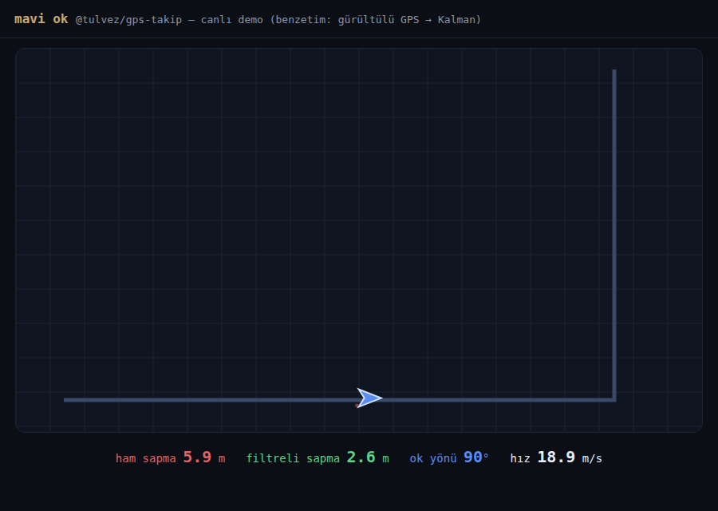

# @tulvez/geotrack 🧭

[](LICENSE)
[](docs/API.md)
[](README.md)

Tulvez Harita'nın **mavi ok GPS takip çekirdeği** — harici SDK yok.
**Sıfır bağımlılık ZORUNLUDUR** bu pakette: `react` yalnız hook için peer'dir,
çekirdek saf JS'tir. Canlıda milyonlarca konum düzeltmesinde sınandı.



> Benzetim kanıtı: ±15m gürültülü GPS → ham sapma 5.9m, Kalman sonrası 2.6m.
> `demo/index.html`'i açıp kendin izle. Gerçek ürün görüntüleri
> (`docs/haritalar-*`) hafta sonu eklenecek.

Belgeler: [API](docs/API.md) · [Katkı](CONTRIBUTING.md) · [Canlı demo](demo/index.html)

## Hakkında

geotrack, 1 Ekim 2026'da açılacak **Tulvez**'in (Türkiye'nin arama motoru +
uygulama paketi) harita uygulamasından doğdu. Sorun şuydu: telefon GPS'i
dururken pusula saçmalar, kavşakta ok 90° sıçrar, tünel çıkışında konum uçar.
Hazır SDK'lar ya ağırdı ya dış servise bağlıydı — biz çekirdeği kendimiz
yazdık: self-host Kalman, yol-yönlü ok, manuel 3B eğim.

1 Ekim'de Tulvez Haritalar'da canlıya çıkacak kodun birebir aynısıdır;
iyileştirmeler önce buraya, sonra ürüne akar. Tek yönlü besleme —
üründen kopuk deney kodu bu repoya girmez.

- Ana proje: [tulvez.com](https://tulvez.com) (1 Ekim 2026)
- Lisans: MIT — ticari kullanım serbest, telif satırını koru.

## Neler var?

| Dosya | İş |
|---|---|
| `src/kalman.js` | Self-host Kalman — 4-state sabit-hız modeli (konum + hız, metre, ENU). Duran GPS pusulasını eler (`>1.5 m/s` + `3°` ölü bant), `2m` titreme kilidi |
| `src/useUserLocation.js` | React hook — GPS izleme + Kalman + watchdog + ivmeölçer kilidi + 60fps ölü-hesap + warm-start |
| `src/arrow.js` | Mavi ok kuralları — yol bearing'i (~60m pencere ortalaması, kavşakta 90° sıçrama yok), ok = yol yönü − kamera açısı |
| `src/map3d.js` | 3B perspektif eğim yardımcısı |
| `src/vendor/kalmanjs.js` | wouterbulten/kalmanjs (MIT, hız kanalı) — aynen gömülü |

## Kullanım

```jsx
import { useUserLocation } from '@tulvez/geotrack'

const { konum, hiz, bearing } = useUserLocation({ izle: true })
// oku döndür: style={{ transform: `rotate(${yolYonu - kameraAcisi}deg)` }}
```

```js
import { getRoadBearing } from '@tulvez/geotrack/ok'
const yon = getRoadBearing(rotaGeometrisi, ilerlemeOrani) // ~60m ortalamalı
```

## Tasarım kararları (neden böyle?)

- **Takip kamerası açı döndürmez** — yalnız konum ortalar; açı yalnız kullanıcı
  isterse. Duran GPS'in pusulası çöptür, oka yol segmenti yön verir.
- **Ok viewport-sabit + CSS rotate** — harita SDK'sının hizalama prop'ları
  güvenilmez olduğu için yön matematiği elde yapılır.
- **Ne pahasına:** doğruluk > pürüzsüzlük. Sıçrama yerine kilit, tahmin yerine bekleme.

## Lisans

MIT — `src/vendor/kalmanjs.js` wouterbulten/kalmanjs (MIT) gömülüdür, başlığındaki
telif korunmuştur.
